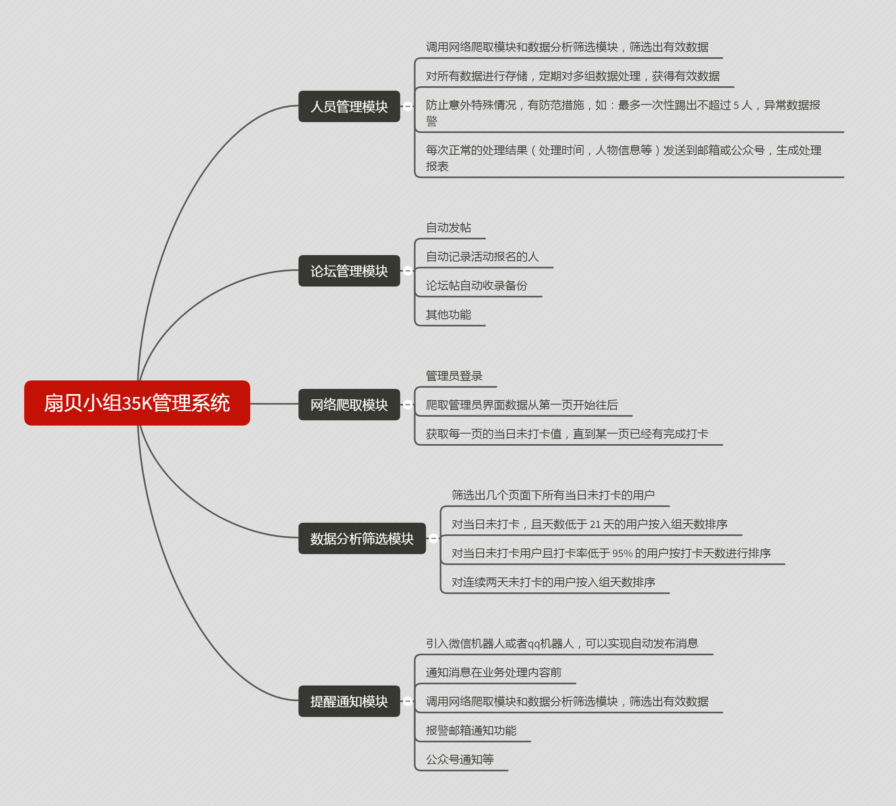

# shanbay_team

*注意：这是一个 python 学习的练手项目，一些功能虽然实现了，但仍然可能存在 bug，很多未进行充分有效的完整测试，使用需慎重！*

  

***

## 功能说明
本项目主要对[扇贝网](www.shanbay.com)中的小组进行自动化管理
### 对小组成员进行管理
- 通过扇贝提供的 api 获取所有组员的打卡数据
- 对数据初步处理后保存所有数据，方便以后的统计处理 
- 对数据进行筛选，如获得打卡排名前n名，贡献前n名等

### 对小组发帖进行管理
- 对小组发帖内容进行备份管理
- 自动发布活动贴
- 对活动贴下面的报名活动成员进行筛选统计

## 文件说明
- main：对其他模块进行调用，完成具体实现功能。
- check_mem：小组成员信息获取，数据筛选模块
- login：账号认证登录模块
- manage_forum：论坛管理模块
- mem_notice：成员通知模块
- GUI：预留数据可视化部分，未必用 python 来实现

## 开发环境
- Python 3.5 32位(Python 解释器, 运行 Python 必备)
- IDE pycharm （开发调试）

## 依赖库
- requests

## GUI 展示
后续待开发...